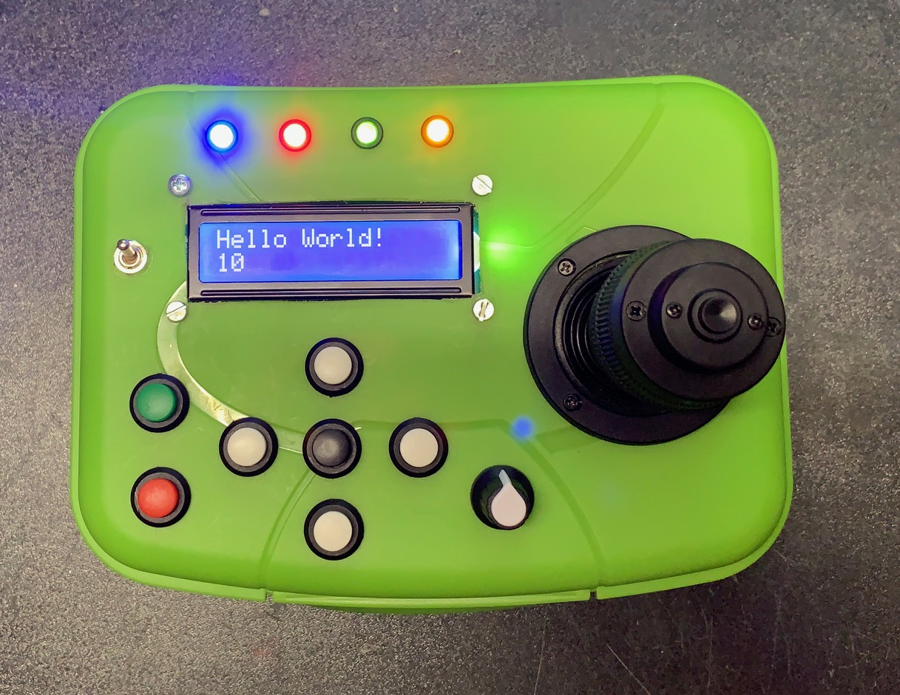

# RoboRemote

**RoboRemote** is an Arduino project for a Bluetooth based remote control.

## Tutorial
A Tutorial is shown on YouTube:

  part 1 - preparing the hardware: https://www.youtube.com/watch?v=xHsCnpfgwEI

  part 2 - schematic and wiring  : https://www.youtube.com/watch?v=I3VOlUwofhE

## Schematic
Here is the schematic of RoboRemote:

## Copyright
Written by Andreas Trappmann.
MIT license, check LICENSE for more information.
All text above must be included in any redistribution

## Release Notes

Version 1.1 - 19.04.2020

  * Added Sketch "RoboRemote_HC05_Terminal" for HC05 Bluetooth module setup.
  * Added Sketch "RoboRemote-Controller" for RoboRemote Bluetooth Controller.
  * Added Sketch "RoboRemote-Receiver" as a demo receiver for the RoboRemote Bluetooth Controller.

Version 1.0 - 19.04.2020

  * Published Sketch "RoboRemote_HW_Test" for basic Hardware testing.
