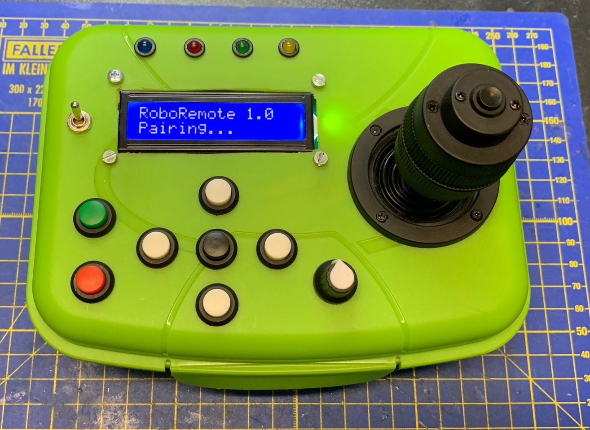
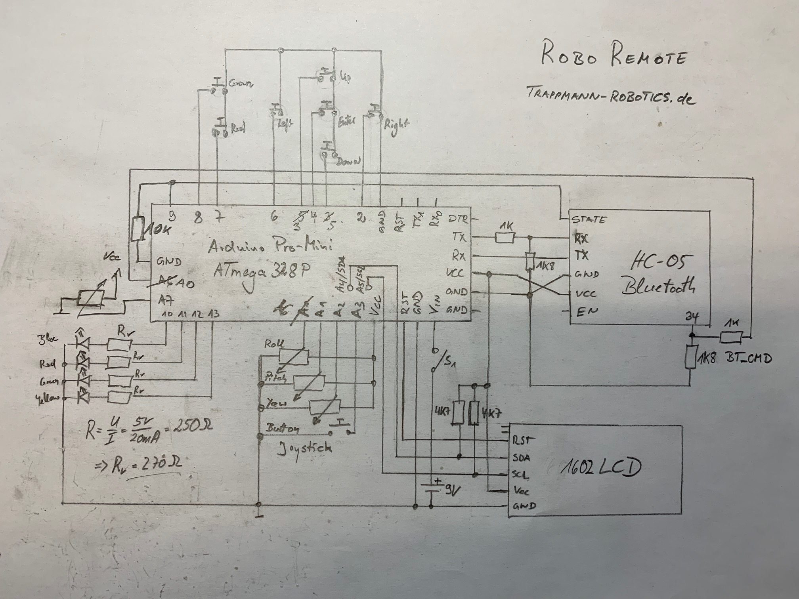
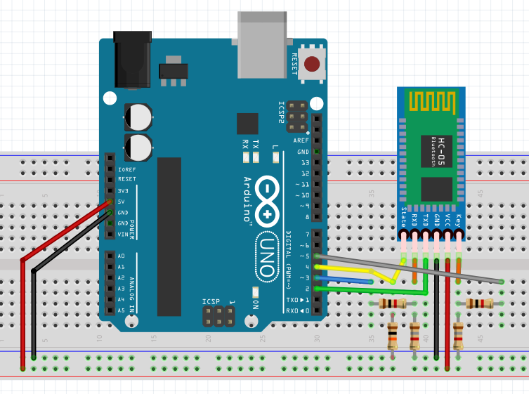

# RoboRemote
**RoboRemote** is an Arduino project for a Bluetooth based remote controller.
It uses a 4-axis joystick, several push buttons, a potentiometer and an 1602 LCD
to control self build robots.
For communication, 2 HC-05 Bluetooth modules are required.
The Sketch is running on an Arduino Pro Mini with an ATmega328(5V, 16MHz).



## Tutorial
A Tutorial for building **RoboRemote** is shown on YouTube:

  part 1 - preparing the hardware: https://www.youtube.com/watch?v=xHsCnpfgwEI

  part 2 - schematic and wiring  : https://www.youtube.com/watch?v=I3VOlUwofhE

  part 3 - programming and test  : https://www.youtube.com/watch?v=15aVeGGLiDI

## Schematic
Here is the schematic of **RoboRemote**. It is explained in the videos
mentioned in the tutorial.



## Part List
  * 1x Arduino Pro Mini
  * 1x FTDI-Adapter for USB-to-Serial communication
  * 2x HC-05 Bluetooth modules
  * 1x 1602 LCD with I2C interface
  * 1x 4-axis Joystick with 10K Ohm potentiometers
  * 7x 12mm push button switches
  * 4x LEDs (diffent colors)
  * 4x 270 Ohm resistors
  * 3x 1K Ohm resistors
  * 3x 1,8K Ohm resistors
  * 2x 4,7K Ohm resistors
  * 1x 10K Ohm resistor
  * 1x 10K Ohm potentiometer
  * 1x on-off switch
  * 1x 9V battery clip
  * 1x 6x4cm universal prototype PCB
  * 1x 3x2cm prototype PCB with strips
  * 4x M3 screws and nuts
  * 2x M3x12mm hexagonal standoff pillars
  * 1x 40pin 2.54mm right angle single row male header
  * 1x 40pin 2.54mm single row male header
  * 1x 40pin 2.54mm single row female header
  * 1x 2mm heat shrink tube, 20cm
  * 2x 2pin Dupont connector
  * 4x 3pin Dupont connector
  * 1x 5pin Dupont connector
  * 20x female Dupont jumper wire terminal connector pins
  * 0.75mm wires, diverse colors

## Sketches
### RoboRemote_HW_Test
**RoboRemote_HW_Test** is a small Sketch for the Arduino Pro Mini to test the wiring
and the functionality after the **RoboRemote** controller has been build.
It will print the button states and the potentiometer values
to the Serial output. LEDs will be blinking and the LCD will show a welcome message.

### RoboRemote_HC05_Terminal
**RoboRemote_HC05_Terminal** is a Sketch for an Arduino to test and configure the
HC-05 Bluetooth modules. This sketch can be used independently of **RoboRemote**
to configure 1 HC-05 module as a slave device and 1 HC-05 module as master.

To configure a HC-05 module it must be connected to an Arduino temporary.
```
Be aware that the BT pins RX and EN/KEY or pin34 of the Bluetooth module
are not 5V tolerant and need a voltage divider between the BT module and the Arduino!
```
For each pin, where a voltage divider is needed,
a 1K resistor is connected between the Arduino pin and the BT pin and another
1K8 or 2K resistor is connected from the BT pin to GND.

BT pins TX and STATE can be connected directly to the Arduino.

Make the following connections between the HC-05 (BT) and an Arduino:

  * BT VCC to Arduino 5V
  * BT GND to Arduino GND
  * BT TX to Arduino pin 2 (no need for voltage divider)
  * BT RX **through a voltage divider** to Arduino pin 3
  * BT STATE to Arduino pin 4 (no need for voltage divider)
  * BT EN/KEY or pin34 **through a voltage divider** to Arduino pin 5

The wiring is shown in the following schematic picture:



The BT STATE pin may be connected with an additional 10K pull-down resistor
to GND. This will give the Arduino a stable input signal but it is not required
for the following configuration tasks.

Now both HC-05 modules can be configured using the Sketch **RoboRemote_HC05_Terminal**.
They will be given different tasks:
1 HC-05 module will be configured in slave mode, the other in master mode.

The **HC05 slave module** is the
receiver from **RoboRemote** and will be placed in the robot which should be controlled.

The **HC05 master module** is the transmitter and is part of the **RoboRemote**
Bluetooth based remote controller.

The **HC05 slave module** for the controlled robot is configured as follows:
1. set the slave role for the HC-05 module: `AT+ROLE=0`
1. configure the desired communication speed: ie. `AT+UART=38400,0,0`
1. set a remote name for the module: `AT+NAME=RoboRemote`
1. define a PIN for secure access: ie. `AT+PSWD=1234`

The **HC05 master module** for **RoboRemote** is configured as follows:
1. set the master role for the HC-05 module: `AT+ROLE=1`
1. configure the same communication speed as for the slave: ie. `AT+UART=38400,0,0`
1. set the same PIN as for the slave: ie. `AT+PSWD=1234`
1. set connection mode for authorized devices only `AT+CMODE=0`
1. set inquire access mode, max 5 devices in 9s `AT+INQM=0,5,9`
1. initialize SPP `AT+INIT`
1. get list of devices in range `AT+INQ`
1. ask for name or specified device `AT+RNAME?xxxx,yy,zzzzzz`
1. pair with specified device `AT+PAIR=xxxx,yy,zzzzzz,9`
1. set BT address `AT+BIND=xxxx,yy,zzzzzz`
1. connect with device `AT+LINK=xxxx,yy,zzzzzz`

After this setup, devices will connect automatically when powered on if they
are not in AT command mode. If AT command mode was selected, the master can
pair with its slave device with the command `AT+INIT`.

### RoboRemote-Controller
**RoboRemote-Controller** is the final Sketch for the **RoboRemote** Bluetooth
based remote controller. When powered on, it connects to the pre-configured
**HC-05 slave module** and displays the connection state by powering on the
blue LED.
While connected, this Sketch will
poll the state of all push button switches and read out all potentiometer
values. All these informations are packed into a transfer packet and is transmitted
to the **RoboRemote-Receiver**.

In version 1, the LCD will only show the connection process and after that
the transmitted packet count.

### RoboRemote-Receiver
**RoboRemote-Receiver** is a Sketch with the **HC05 slave module** to
show that a connection with the **RoboRemote-Controller** is established.
For demonstrating purposes, all data received from the **RoboRemote-Controller**
is printed to the Serial output.

This Sketch can be used as a basis, of how to embedd the **HC05 slave module**
into your own robotic projects.

## Copyright
**RoboRemote** is written by Andreas Trappmann from
[Trappmann-Robotics.de](https://www.trappmann-robotics.de/). It
is published under the MIT license, check LICENSE for more information.
All text above must be included in any redistribution.

## Release Notes

Version 2.0 - 05.05.2021

  * Added a configuration menu for HC-05 master and slave modules
  * Added direct binding to accellerate link of Bluetooth modules
  
Version 1.1 - 19.04.2020

  * Added Sketch "RoboRemote_HC05_Terminal" for HC05 Bluetooth module setup.
  * Added Sketch "RoboRemote-Controller" for RoboRemote Bluetooth Controller.
  * Added Sketch "RoboRemote-Receiver" as a demo receiver for the RoboRemote Bluetooth Controller.

Version 1.0 - 19.04.2020

  * Published Sketch "RoboRemote_HW_Test" for basic Hardware testing.
